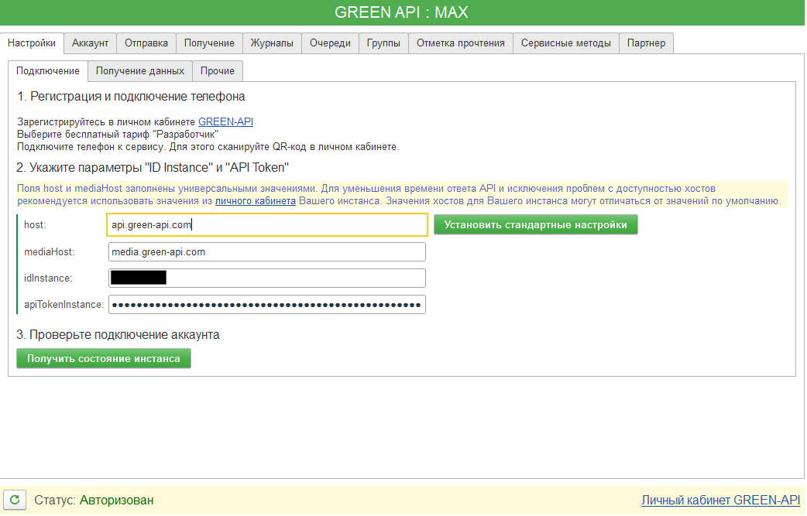

# Демо обработка для работы с MAX из 1С  

Репозиторий представляет собой исходники конфигурации в формате выгрузки xml файлов с одной обработкой. Из обработки можно отправить сообщение в мессенджер MAX. Интеграция с MAX сделана через REST сервис [green-api.com](https://green-api.com/max)  

Данная обработка создана на основе ранее разработанной обработки интеграции [WhatsApp с GREEN-API](https://github.com/green-api/whatsapp-api-client-1c).  

В процессе разработки была сохранена общая архитектура, логика взаимодействия с API и структура интерфейса, что обеспечивает единый подход к работе с мессенджерами в 1С.  

При этом обработка была адаптирована под особенности мессенджера MAX, включая авторизацтю по QR-коду.  

## Оглавление  

* [Требования](#Требования)  
* [Важные отличия MAX от WhatsApp](#Важные-отличия-MAX-от-WhatsApp)  
  * [Основные отличия](#основные-отличия)  
* [Возможности обработки](#возможности-обработки)  
* [Регистрация и подготовка](#регистрация-и-подготовка)  
  * [Процесс авторизации инстанса MAX (через QR-код)](#процесс-авторизации-инстанса-max-через-qr-код)  
  * [Подключение MAX в обработке](#подключение-max-в-обработке)  
  * [Отправка сообщений](#отправка-сообщений)  
  * [Получение сообщений](#получение-сообщений)  
  * [Журналы и очереди](#журналы-и-очереди)  
  * [Группы](#группы)  
* [Работа с контактами и сообщениями](#работа-с-контактами-и-сообщениями)  
* [Партнёрский режим GREEN-API](#партнёрский-режим-green-api)  
* [Использование обработки в собственных конфигурациях](#использование-обработки-в-собственных-конфигурациях)  
  * [Отправка сообщения в чат](#отправка-сообщения-в-чат)  
  * [Отправка сообщения в группу](#отправка-сообщения-в-группу)  
* [Установка обработки из исходников](#установка-обработки-из-исходников)  


## Требования  
* Для запуска обработки нужна Платформа 1С не ниже версии 8.3.10.  
* Для загрузки исходников нужно Платформа 1С не ниже версии 8.3.16.1063  

## Важные отличия MAX от WhatsApp  

При работе с мессенджером MAX через GREEN-API существуют принципиальные отличия от интеграции WhatsApp, которые важно учитывать при разработке и эксплуатации.  

### Основные отличия  

* **Отсутствие привязки к телефону**  
Инстанс MAX не зависит от постоянного подключения мобильного устройства к интернету, что повышает стабильность работы.  

* **Более простое повторное подключение**  
В большинстве случаев повторная авторизация не требуется, даже при перезапуске инстанса.  

* **Работа с группами**  
Групповые чаты идентифицируются ID, начинающимся со знака -, аналогично WhatsApp, но управление группами не требует подтверждений на телефоне.  

* **Фокус на серверное использование**  
API мессенджера MAX лучше подходит для серверных сценариев, ботов, CRM и интеграций с 1С без участия пользователя.  

Детальное описание отличий доступно в [официальной документации API мессенджера MAX](https://green-api.com/v3/docs/important-differences).

## Возможности обработки  

* Отправка текстовых сообщений  
* Отправка и получение файлов  
* Работа с групповыми чатами  
* Получение входящих сообщений  
* Журналы входящих и исходящих сообщений  
* Очереди сообщений  
* Отметка сообщений как прочитанных  
* Webhook-уведомления  
* Сервисные методы управления инстансом  

## Регистрация и подготовка  

1. Зарегистрируйтесь в [личном кабинете GREEN-API](https://console.green-api.com)  
2. Создайте инстанс MAX  
3. Получите ID Instance и API Token  

### Процесс авторизации инстанса MAX (через QR-код)  

Авторизация выполняется на вкладке `Настройки` -> `Подключение` и завязана на кнопку `Получить состояние инстанса`.  

Шаг 1. Запрос состояния инстанса  
1. Заполните параметры подключения (`apiUrl`, `mediaUrl`, `idInstance`, `apiTokenInstance`).
2. Нажмите `Получить состояние инстанса`.  

  

### Подключение MAX в обработке  
### Отправка сообщений  
### Получение сообщений  
### Журналы и очереди  
### Группы  
## Работа с контактами и сообщениями  
## Партнёрский режим GREEN-API  

## Использование обработки в собственных конфигурациях  

Обработка имеет программный интерфейс, оформленный в соответствии со [стандартами разработки 1С](https://its.1c.ru/db/v8std). Вы можете встроить ее в свою конфигурацию и вызывать АПИ на сервере через создание объекта. Пример использования:

### Отправка сообщения в чат  

```bsl
АПИ = Обработки.GreenAPI.Создать();
АПИ.IdInstance = "ВАШ_ИНСТАНС";
АПИ.ApiToken = "ВАШ_ТОКЕН";
Ответ = АПИ.ОтправитьТекст("79001234567", "Hello"); 
```

### Отправка сообщения в группу  

```bsl
АПИ = Обработки.GreenAPI.Создать();
АПИ.IdInstance = "ВАШ_ИНСТАНС";
АПИ.ApiToken = "ВАШ_ТОКЕН";
Ответ = АПИ.ОтправитьТекстВГруппу("79001234567-1615394251@g.us", "Hello"); 
```

## Установка обработки из исходников  

Исходники в репозитории - это xml выгрузка из конфигуратора 1С версии 8.3.16 в режиме совместимости с 8.3.10. Скачайте исходники с репозитория и загрузите в конфигуратор с помощью команды ``Конфигурация`` -> ``Загрузить конфигурацию из файлов``

